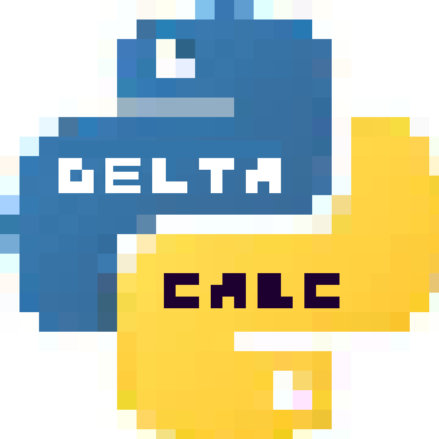

# DeltaCalc
<br>

<br>
<br>
<br>
DeltaCalc is a simple and standard calculator application written in Python.
<br>
The graphics in this application were implemented using the Tkinter framework.

 This application offers arithmetic operations (+, -, *, /, ^, root, modulus)  and functions (sin, cos, tan, log).
<br>
<br>

## Features

 - **Standard calculator operations.**
 - **History of operations performed.**
 - **Settings to change the layout of the application for user readability. (Font, Theme)**
 
<br>

## Prerequisite Modules

 - tkinter (**version 8.6** is recommended)
 - math
 - functools
 - datetime

<br>

## Usage

The recommended operating systems are Windows, macOS and Linux, as they are most compatible with the Tkinter framework. See more info [here](https://en.wikipedia.org/wiki/Tkinter#:~:text=Tkinter%20is%20included%20with%20standard,and%20macOS%20installs%20of%20Python.).
<br>

After downloading zip file and extracting: 
```C:\...\>python DeltaCalc```
<br>

**Chaining operations isn't a feature yet (5 + 8 + 6)**
